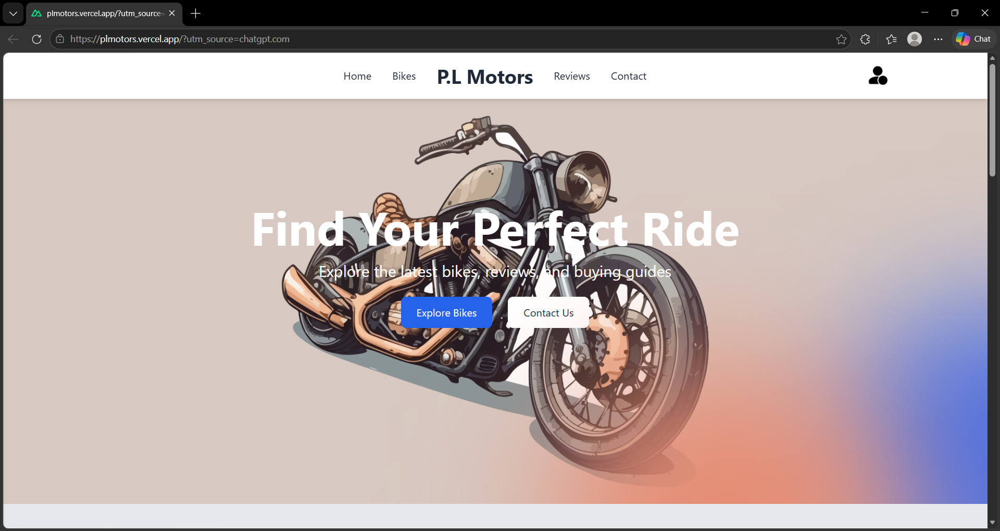
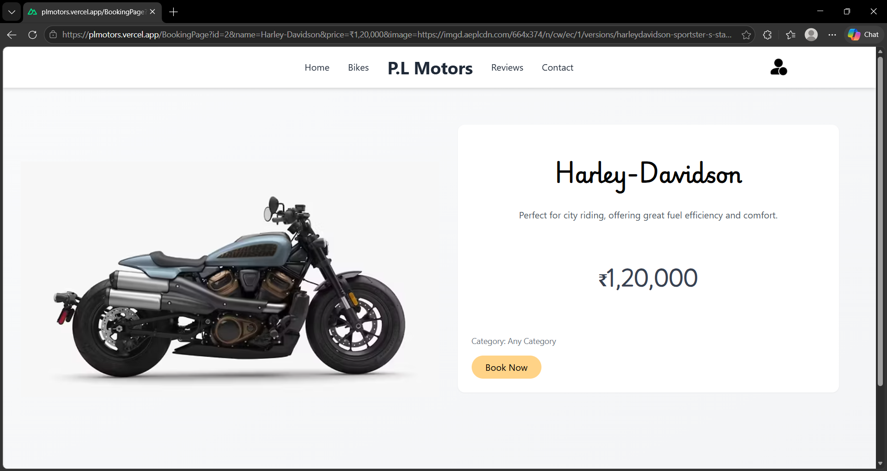
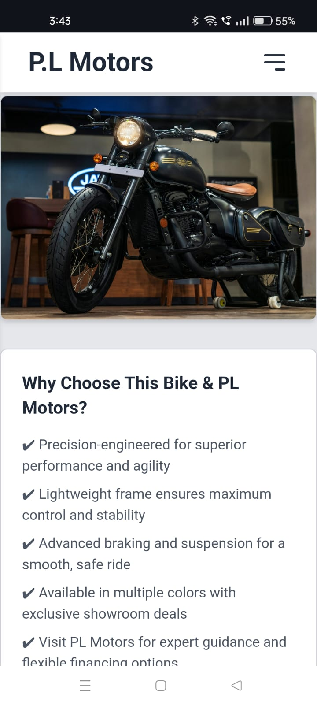
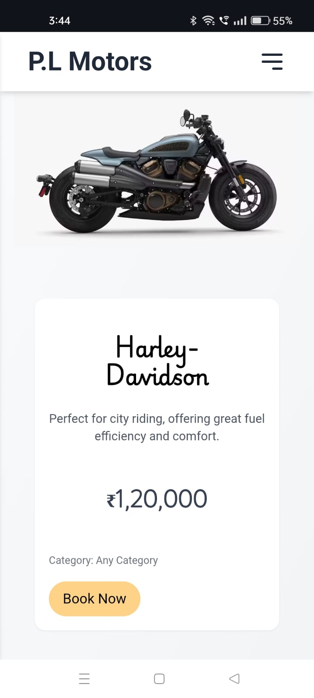
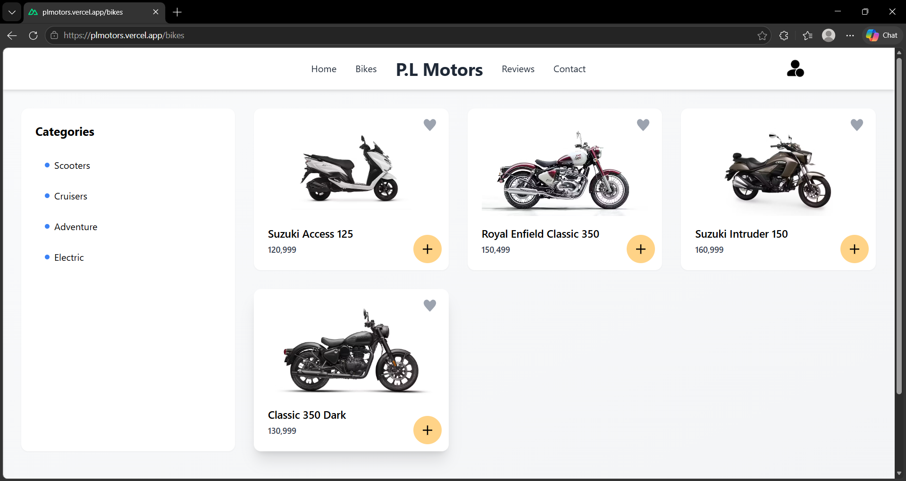

# P.L Motors

A modern bike showroom website built using Nuxt.js and Tailwind CSS.

## Live Demo

[Live Demo](https://plmotors.vercel.app)

## Features

- Responsive modern UI
- Bike showcase section
- Smooth navigation
- Mobile-friendly design
- Custom styling with Tailwind CSS
- Interactive frontend experience

## Tech Stack

- Nuxt.js
- Tailwind CSS
- JavaScript
- HTML
- CSS

## Project Purpose

This project was created for a bike showroom client to provide a modern and visually engaging online presence.

## Screenshots

### Desktop View





### Mobile View







## Installation

```bash
npm install
npm run dev
